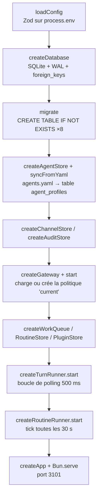
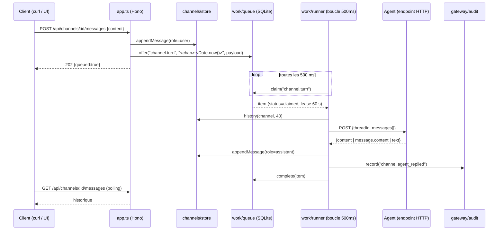
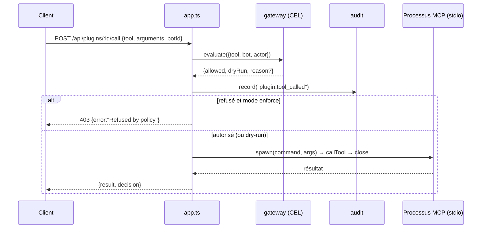

# OpenBot Server Lite — Documentation technique

> Documentation générée à partir de l'analyse du code de `server-lite.zip` (≈ 1 350 lignes de TypeScript, 21 fichiers sources + 2 fichiers de tests).
> Les numéros de ligne cités (`fichier.ts:42`) correspondent à l'archive analysée.

## Sommaire

| # | Fichier | Contenu |
|---|---------|---------|
| 00 | `00-INDEX-architecture.md` | Ce fichier : vue d'ensemble, flux, arborescence, ordre de démarrage |
| 01 | `01-demarrage-config-api-auth.md` | `index.ts`, `config.ts`, `app.ts` (toutes les routes), `auth/guards.ts` |
| 02 | `02-base-de-donnees.md` | `db/client.ts`, `db/schema.ts`, les 8 tables SQLite |
| 03 | `03-agents.md` | `agents/store.ts`, `endpoint-check.ts`, `ag-ui-client.ts`, `agents.yaml` |
| 04 | `04-canaux.md` | `channels/store.ts` |
| 05 | `05-file-de-travail.md` | `work/queue.ts`, `work/runner.ts` |
| 06 | `06-routines.md` | `routines/store.ts`, `routines/runner.ts` |
| 07 | `07-gateway-politique-audit.md` | `gateway/policy.ts`, `gateway/store.ts`, `gateway/audit.ts` |
| 08 | `08-plugins-mcp.md` | `plugins/store.ts`, `plugins/mcp.ts` |
| 09 | `09-tests-outillage.md` | Tests, `package.json`, `tsconfig.json`, `.env`, README, fichiers annexes |
| 10 | `10-analyse-et-comparaison.md` | Avis critique, bugs vérifiés, comparaison avec `CopilotKit/OpenBot` (`server/`) |

## Qu'est-ce que Server Lite ?

Un serveur HTTP **mono-processus, mono-utilisateur** qui reprend les *concepts* du serveur OpenBot complet de CopilotKit, sans ses dépendances lourdes (PostgreSQL, CopilotKit Intelligence, conteneurs de « computers », SSO…).

Il permet de :

1. **Déclarer des agents** (profils « coworkers ») qui pointent vers un endpoint HTTP externe.
2. **Créer des canaux** (conversations) rattachés à un ou plusieurs agents, avec historique persistant.
3. **Envoyer un message** dans un canal : le tour d'agent est mis **en file d'attente**, exécuté en arrière-plan, et la réponse est stockée dans l'historique.
4. **Planifier des routines** (prompt récurrent via cron) qui injectent un message dans un canal.
5. **Gouverner des actions** par une politique **CEL** (`deny` avant `allow`) et tracer tout dans un **journal d'audit**.
6. **Enregistrer des serveurs MCP (stdio)** et appeler leurs outils à travers la politique.

## Stack technique

| Couche | Technologie |
|--------|-------------|
| Runtime | **Bun** (≥ 1.1) — utilise `Bun.serve`, `bun:sqlite`, `Bun.sleep`, `bun test` |
| HTTP | **Hono** ^4.10 |
| Base de données | **SQLite** (mode WAL) via `bun:sqlite` |
| ORM | **Drizzle ORM** ^0.45 (`drizzle-orm/bun-sqlite`) |
| Validation | **Zod** ^4 |
| Politique | **cel-js** ^0.8 (Common Expression Language) |
| Cron | **cron-parser** ^5 |
| MCP | **@modelcontextprotocol/sdk** ^1.30 (client stdio) |
| Config agents | **yaml** ^2.9 |
| Langage | TypeScript 5.9, `strict: true` |

## Arborescence

```
server-lite/
├── agents.yaml / agents.example.yaml   # Profils d'agents chargés au démarrage
├── .env / .env.example                 # PORT, DATABASE_PATH, LITE_API_KEY, ALLOW_PRIVATE_HOSTS, ACTION_POLICY_MODE
├── package.json, tsconfig.json, bun.lock, package-lock.json
├── README.md
├── data/                               # SQLite (+ WAL/SHM) — créé au démarrage, ignoré par git
├── tests/
│   ├── endpoint.test.ts                # 2 tests (SSRF)
│   └── policy.test.ts                  # 2 tests (CEL)
└── src/
    ├── index.ts                        # Point d'entrée : câblage + démarrage
    ├── config.ts                       # Variables d'environnement validées (Zod)
    ├── app.ts                          # Application Hono : toutes les routes HTTP
    ├── auth/guards.ts                  # Middleware Bearer + utilisateur fixe
    ├── db/{client,schema}.ts           # Connexion SQLite, DDL, schéma Drizzle
    ├── agents/{store,endpoint-check,ag-ui-client}.ts
    ├── channels/store.ts
    ├── work/{queue,runner}.ts          # File de travail + exécuteur de tours
    ├── routines/{store,runner}.ts      # Routines cron
    ├── gateway/{policy,store,audit}.ts # Politique CEL + audit
    └── plugins/{store,mcp}.ts          # Serveurs MCP stdio
```

## Pattern de conception : « factory + injection »

Aucun singleton global, aucune classe. Chaque module exporte une fonction `createXxx(deps)` qui retourne un **objet de méthodes** fermé sur ses dépendances :

```ts
const agents   = createAgentStore(db, config.ALLOW_PRIVATE_HOSTS);
const channels = createChannelStore(db);
const queue    = createWorkQueue(db);
const turnRunner = createTurnRunner({ queue, channels, agents, audit });
```

Les types publics sont dérivés : `export type AgentStore = ReturnType<typeof createAgentStore>`.
`app.ts` ne connaît que ces types (`import type`) : il est testable en lui injectant des doubles.

## Ordre de démarrage (`index.ts`)



Trois « processus logiques » tournent donc dans **un seul processus Bun** : le serveur HTTP, la boucle d'exécution des tours, la boucle des routines.

## Flux principal : envoyer un message à un agent



En cas d'exception : `audit.record("channel.turn_failed")` puis `queue.fail(item)` — **aucun nouvel essai**.

## Flux secondaire : appel d'un outil MCP gouverné



## Matrice « module → tables → routes »

| Module | Tables SQLite | Routes HTTP |
|--------|---------------|-------------|
| agents | `agent_profiles` | `GET/POST /api/agents` |
| channels | `channels`, `channel_messages` | `GET/POST /api/channels`, `GET/POST /api/channels/:id/messages` |
| work | `work_items` | *(aucune — interne)* |
| routines | `routines` | `GET/POST /api/routines` |
| gateway | `action_policy` | `GET/PUT /api/admin/boundaries`, `POST /api/gateway/decide` |
| audit | `audit_events` | `GET /api/admin/audit-events` |
| plugins | `plugin_servers` | `GET/POST /api/plugins`, `GET /api/plugins/:id/tools`, `POST /api/plugins/:id/call` |
| auth | — | middleware sur `/api/*` ; `GET /api/me` |
| (racine) | — | `GET /health`, `GET /api/capabilities` |

## Ce qui est volontairement absent

D'après le README : pas de « computer » (navigateur/fichiers par bot), pas de superviseur, voix, SSO, apprentissage automatique, pas de CopilotKit Intelligence (threads/mémoire), pas de Composio, pas de réplication multi-instance, pas de parité d'API avec le serveur complet. Voir `10-analyse-et-comparaison.md`.
