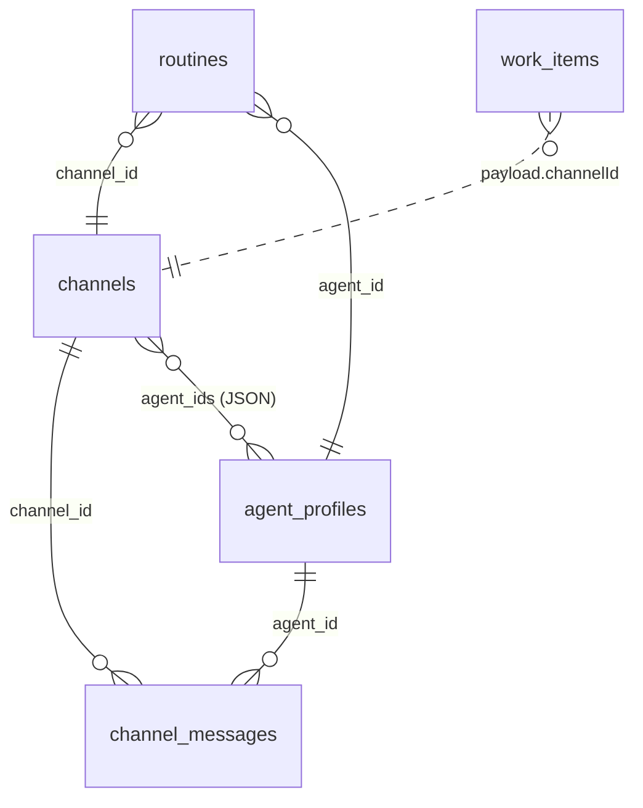

# 02 — Base de données (SQLite + Drizzle)

Fichiers couverts : `src/db/client.ts` (90 l.), `src/db/schema.ts` (79 l.).

## Rôle
Fournir une connexion SQLite typée (Drizzle) et créer les tables au démarrage.

## `db/client.ts`

### Composition
| Fonction | Rôle |
|----------|------|
| `createDatabase(path)` | `mkdirSync(dirname)` → `new Database(path)` (`bun:sqlite`) → `PRAGMA journal_mode = WAL` → `PRAGMA foreign_keys = ON` → `drizzle(sqlite, {schema})` |
| `migrate(db)` | Exécute un bloc SQL unique de `CREATE TABLE IF NOT EXISTS …` via `db.$client.exec` |
| `type Db` | `ReturnType<typeof createDatabase>` — injecté dans tous les stores |

### Particularités
- **WAL** : lectures concurrentes des écritures, d'où les fichiers `.sqlite-wal` et `.sqlite-shm` à côté de la base (présents dans l'archive → la base était « vivante »).
- La « migration » n'est **pas versionnée** : elle ne sait que créer des tables absentes. Toute évolution de colonne nécessite une intervention manuelle (Drizzle Kit n'est pas utilisé).
- `foreign_keys = ON` est activé, mais **aucune clé étrangère n'est déclarée** dans le DDL : le pragma est donc sans effet.
- Le DDL (SQL brut) et `schema.ts` (Drizzle) sont **dupliqués** à la main : ils doivent rester synchronisés.

## `db/schema.ts` — les 8 tables

Convention : colonnes en `snake_case` côté SQL, `camelCase` côté TypeScript ; dates stockées en **millisecondes** (`integer … mode:"timestamp_ms"`) ; tableaux/objets stockés en **JSON texte**.

### `agent_profiles`
| Colonne | Type | Notes |
|---------|------|-------|
| `id` | TEXT PK | UUID (API) ou slug (YAML, ex. `general`) |
| `name`, `title`, `role_description` | TEXT NOT NULL | |
| `visibility` | TEXT enum `public`\|`private` | Non appliqué à la lecture |
| `endpoint` | TEXT NOT NULL | URL AG-UI validée |
| `owner_user_id` | TEXT NULL | Renseigné seulement si `private` via API |
| `created_at` | INTEGER ms | |

### `channels`
| Colonne | Type | Notes |
|---------|------|-------|
| `id` | TEXT PK | UUID |
| `name` | TEXT | |
| `thread_id` | TEXT | UUID envoyé à l'agent pour maintenir le fil |
| `agent_ids` | TEXT | **JSON** `string[]` |
| `active` | INTEGER bool | Toujours `true`, jamais lu |
| `last_message_at` | INTEGER ms NULL | Sert au tri de la liste |
| `created_at` | INTEGER ms | |

### `channel_messages`
| Colonne | Type | Notes |
|---------|------|-------|
| `id` | TEXT PK | |
| `channel_id` | TEXT | Pas de FK, **pas d'index** |
| `role` | enum `user`\|`assistant`\|`system` | |
| `agent_id` | TEXT NULL | Renseigné pour les réponses d'agent |
| `content` | TEXT | |
| `created_at` | INTEGER ms | |

### `audit_events`
`id`, `type` (ex. `agent.created`), `actor_id`, `payload` (JSON, **après redaction**), `created_at`.

### `action_policy`
Une seule ligne utile : `id = "current"`, `mode`, `deny` (JSON `string[]`), `allow` (JSON `string[]`).

### `routines`
`id`, `name`, `cron`, `channel_id`, `agent_id`, `prompt`, `enabled`, `created_at`.

### `work_items`
| Colonne | Notes |
|---------|-------|
| `id` PK | UUID |
| `kind` | Type de tâche (seul `channel.turn` est utilisé) |
| `key` | Clé d'idempotence |
| `payload` | JSON |
| `status` | `pending` → `claimed` → `done` \| `failed` |
| `lease_until` | Fin du « bail » quand `claimed` |
| `attempts` | Compteur d'essais (incrémenté au `claim`) |
| `created_at` | |

Index : `UNIQUE (kind, key)` (`work_items_kind_key`) — c'est le seul index du schéma.

### `plugin_servers`
`id`, `name`, `transport` (enum : `stdio` uniquement), `command`, `args` (JSON `string[]`), `enabled`.

## Diagramme des relations (logiques, non déclarées en SQL)

## Points d'attention
- **Ordre de l'historique** : les requêtes sur `channel_messages` trient par `created_at` **croissant** (voir `04-canaux.md`).
- Absence d'index sur `channel_messages(channel_id, created_at)` → lecture en balayage complet à mesure que la table grossit.
- Nettoyage : aucune purge des `work_items` terminés ni des `audit_events`.
