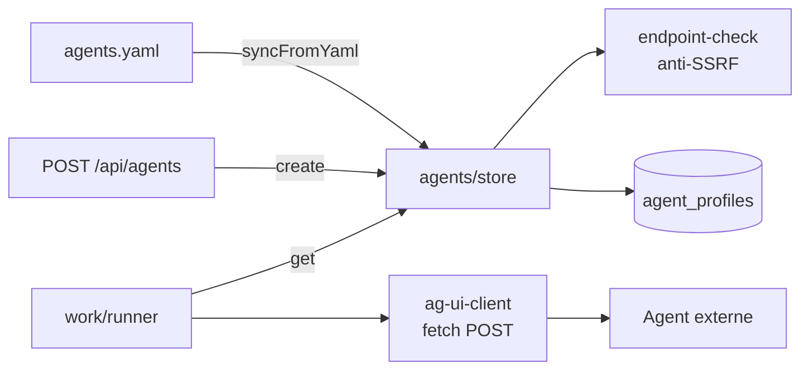

# 03 — Module `agents/`

Fichiers couverts : `src/agents/store.ts` (121 l.), `src/agents/endpoint-check.ts` (38 l.), `src/agents/ag-ui-client.ts` (40 l.), plus `agents.yaml` / `agents.example.yaml`.

## Rôle
Gérer les **profils d'agents** (« coworkers ») et communiquer avec eux via HTTP.



---

## `store.ts` — `createAgentStore(db, allowPrivateHosts)`

### Type `AgentProfile`
`{ id, name, title, roleDescription, visibility: "public"|"private", endpoint, ownerUserId: string|null, createdAt: Date }`

### Méthodes

| Méthode | Description |
|---------|-------------|
| `list()` | Tous les agents (aucun filtre de visibilité) |
| `get(id)` | Un agent ou `null` |
| `create(input, ownerUserId)` | Valide (Zod) → vérifie l'endpoint → insère avec `id = randomUUID()`. `ownerUserId` n'est conservé que si `visibility === "private"`. Lève une `Error` si l'endpoint est refusé |
| `syncFromYaml(path)` | Lit le YAML s'il existe ; pour chaque agent : **vérifie l'endpoint** (ignore silencieusement si refusé), puis **met à jour** (si l'id existe) ou **insère** |

### Schéma de création (Zod)
`name`, `title`, `roleDescription` : `string.min(1)` ; `visibility` : `public|private` ; `endpoint` : `string.url()`.

### Sémantique de `syncFromYaml`
- **Upsert par `id`** : le YAML écrase `name/title/roleDescription/visibility/endpoint` à chaque démarrage (une modification faite ailleurs pour le même id est perdue).
- **Pas de suppression** : retirer un agent du YAML ne le supprime pas de la base.
- Le YAML est simplement *casté* (`as {...}`), pas validé : un champ manquant provoquerait une erreur SQL `NOT NULL` au démarrage ; un endpoint refusé est sauté **sans log**.

### Format de `agents.yaml`
```yaml
agents:
  - id: general
    name: General Assistant
    title: Assistant
    roleDescription: Aide générale au quotidien.
    visibility: public
    endpoint: http://127.0.0.1:8080/ag-ui   # obligatoire en Lite
```
`agents.yaml` est dans `.gitignore` ; `agents.example.yaml` sert de modèle (dans l'archive, les deux fichiers sont identiques).

---

## `endpoint-check.ts` — `checkAgentEndpoint(raw, allowPrivateHosts)`

### Rôle
Filtre anti-SSRF « de base », décrit comme une version allégée de `server/src/agents/endpoint.ts` du serveur complet.

### Retour
`{ allowed: true, url }` ou `{ allowed: false, reason }`.

### Règles appliquées
1. `new URL(raw.trim())` ; sinon « URL invalide ».
2. Protocole `http:` ou `https:` uniquement.
3. Hôtes **toujours** interdits : `169.254.169.254`, `metadata.google.internal`.
4. Hôtes « privés » (refusés si `allowPrivateHosts=false`) : `localhost`, `*.local`, `127.*`, `10.*`, `192.168.*`, `[::1]…`.

### Limites (vérifiées par exécution avec `allowPrivateHosts=false`)
Ces adresses sont **acceptées** :

| URL | Pourquoi c'est un problème |
|-----|----------------------------|
| `http://172.16.0.5/` | La plage privée `172.16.0.0/12` n'est pas couverte |
| `http://0.0.0.0/` | Désigne souvent la machine locale |
| `http://169.254.10.10/` | Plage link-local : seule l'IP `169.254.169.254` exacte est bloquée |
| `http://[fd00::1]/` | IPv6 ULA (privé) non couvert |
| `http://[::ffff:127.0.0.1]/` | IPv4-mappée, normalisée en `[::ffff:7f00:1]` : contourne le test `127.` |

De plus : la vérification n'a lieu **qu'à l'enregistrement** ; `fetch` suit les redirections par défaut et la résolution DNS n'est pas contrôlée (*DNS rebinding*).

---

## `ag-ui-client.ts` — `runAgUiTurn(options)`

### Rôle
Exécuter **un tour** : envoyer l'historique à l'agent et récupérer une réponse texte.

### Contrat HTTP implémenté
```
POST <endpoint>
content-type: application/json
accept: application/json

{ "threadId": "<uuid du canal>", "messages": [ {role, content}, … ] }
```
Réponse acceptée (premier champ présent) : `content`, `message.content`, `text` ; à défaut le JSON entier est sérialisé en texte. Une réponse vide lève `Réponse AG-UI sans contenu texte.` ; un statut non-2xx lève `AG-UI <status>: <500 premiers caractères>`.

### Types
`ChatMessage = { role: "user"|"assistant"|"system"; content: string }`.

### Points d'attention
- Ce n'est **pas** le protocole AG-UI complet : celui-ci échange un flux d'événements (SSE) avec un `RunAgentInput` riche (runId, tools, state…). Ici il s'agit d'un contrat **JSON requête/réponse simplifié** ; un agent AG-UI standard (LangGraph, Mastra…) ne répondra pas tel quel. Le README le signale (« adaptez `ag-ui-client.ts` »).
- **Aucun timeout** : `options.signal` existe mais `work/runner.ts` ne le fournit jamais. Un agent qui ne répond pas bloque la boucle d'exécution (voir `05-file-de-travail.md`).
- Ni `roleDescription`, ni `title` de l'agent ne sont transmis comme message `system`.
- Pas de streaming : la réponse est récupérée en bloc.
